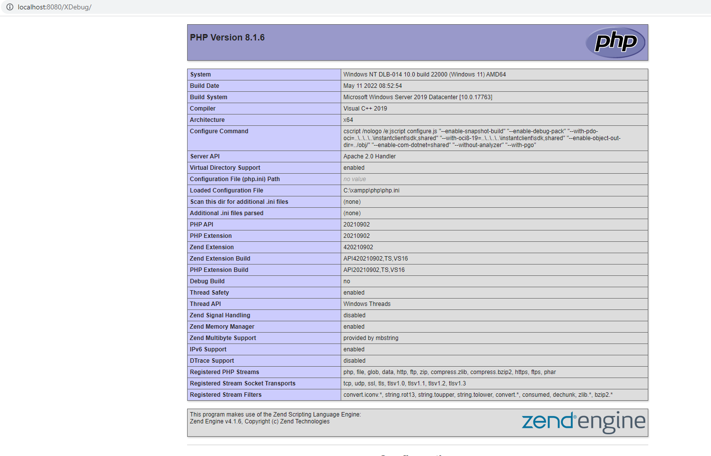

# XDebug_VsCode-PHP
## Debugging PHP with XDebug and VsCode

- Vào visual code tạo mơi một file với nội dung sau:
```Dockerfile
<?php 
phpinfo();

?>
```

- Chạy xampp và chạy file có chứa nội dung vừa nhập: 


