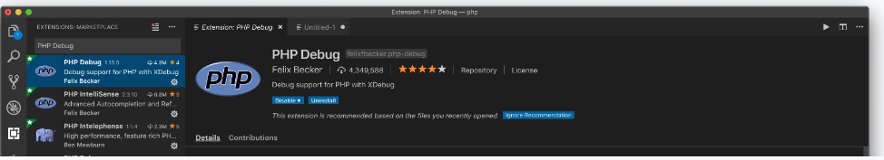

# XDebug_VsCode-PHP
## Debugging PHP with XDebug and VsCode

- Vào visual code tạo mơi một file với nội dung sau:
```Dockerfile
<?php 
phpinfo();

?>
```

- Chạy xampp và chạy file có chứa nội dung vừa nhập: 


Hãy chọn tất cả nội dung xuất ra đó (Ctrl - A), rồi copy (Ctrl - C) rồi vào trang xdebug wizard, dán toàn bộ nội dung có được vào hộp nhập liệu của trang đó. Sau đó bấm vào nút bấm Analyse my phpinfo() output, sau khi nó phân tích thì sẽ có đường link để bạn tải xdebug thích hợp về máy. Ví dụ, file tải về là php_xdebug-2.7.2-7.2-vc15-x86_64.dll, hãy lưu vào thư mục chứa phần mở rộng của PHP, trên máy tôi là C:\wamp64\bin\php\php7.2.18\zend_ext

Sau đó thêm vào php.ini (ví dụ C:\wamp64\bin\php\php7.2.18\ini) nội dung:

```Dockerfile
<?php 
zend_extension = C:\wamp64\bin\php\php7.2.18\zend_ext\php_xdebug-2.7.2-7.2-vc15-x86_64.dll
```

Cấu hình Xdebug
Trước khi cấu hình nắm một số nguyên tắc làm việc của Xdebug khi kết nối với IDE như sau: IDE phải tạo ra một phiên làm việc và mở ra một cổng (mặc định 9000, với địa chỉ IP, mặc định localhost) để XDebug của PHP kết nối vào mỗi khi PHP chạy các script.

Bạn cập nhật vào php.ini nội dung sau:

```Dockerfile
xdebug.remote_enable=1
xdebug.remote_connect_back=1
xdebug.remote_autostart=1
xdebug.remote_connect_back=1
xdebug.remote_port=9000

xdebug.profiler_enable=0
xdebug.var_display_max_depth = 5
xdebug.var_display_max_children = 256
xdebug.var_display_max_data = 1024
xdebug.profiler_enable=0

#xdebug.remote_log = /var/logs/xdebug.log - chỉnh đến đường dẫn lưu log

xdebug.remote_connect_back=0
xdebug.remote_host=localhost
```
Thực hiện Debug trên Visual Studio Code
Trong Visual Studio Code, cần cài đặt Extension có tên PHP Debug, phần mở rộng này cho phép tạo ra Client lắng nghe trên cổng do bạn ấn định để xDebug kết nối vào.



Khi mở dự án PHP của bạn xong, chọn biểu tượng Debug (hình con bọ), sau đó chọn biểu tượng bánh xe, chọn Add Config PHP cấu hình như hình dưới:


Sau khi chọn xong, nó sẽ tạo ra file launch.json, bạn sửa đổi file này nội dung như sau:

```Dockerfile
{
    // Use IntelliSense to learn about possible attributes.
    // Hover to view descriptions of existing attributes.
    // For more information, visit: https://go.microsoft.com/fwlink/?linkid=830387
    "version": "0.2.0",
    "configurations": [
        {
            "name": "Listen for XDebug",
            "type": "php",
            "request": "launch",
            "port": 9000,
            "hostname": "localhost"

        },
        {
            "name": "Launch currently open script",
            "type": "php",
            "request": "launch",
            "program": "${file}",
            "cwd": "${fileDirname}",
            "port": 9000,
        }
    ]
}
```
Lúc này, bạn có thể đặt breakpoint, hoặc gỡ rối nếu phát sinh ngoại lệ. Bạn bấm vào nút mũi tên xanh (play) để bắt đầu tạo client phiên làm việc, lắng nghe Xdebug kết nối tới ở cống 9000 của localhost, nó xuất hiện như hình dưới.


Giả sử đặt breakpoint vào file test.php, khi chạy file này từ trình duyệt hoặc CLI, lập tức XDebug hoạt động.


Bạn đã bắt đầu có thể thực hiện các thao tác debug (step over, step into ...), trong quá trình này bạn sẽ giám sát được giá trị các biến, call stack ...
